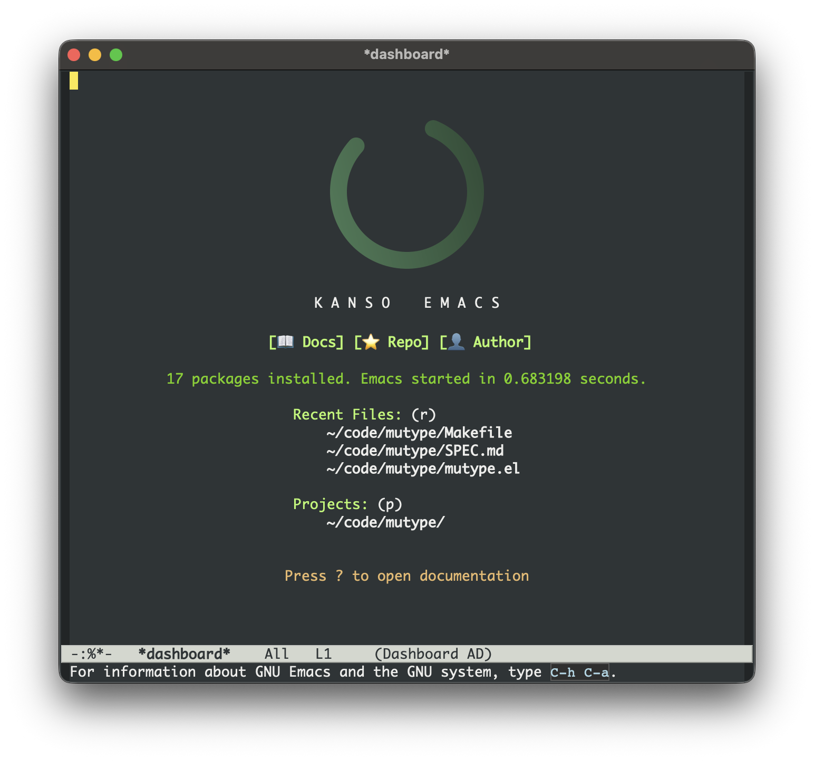

<div align="center">


# 🌿 Kanso Emacs

[](https://www.gnu.org/software/emacs/)
[](https://suxiaogang223.github.io/kanso-emacs/)
[](LICENSE)

*A high-performance, modular, and modern Emacs configuration tailored for software engineering.*<br>
*Kanso (簡素) means simplicity; eliminating clutter to reveal the essential.*<br>
*Motto: 如无必要，勿增代码 - Do not add code unless it is necessary.*

</div>

---

## 📖 Documentation

Comprehensive guides, setup instructions, and language-specific workflows are available on our **[Documentation Site](https://suxiaogang223.github.io/kanso-emacs/)**.

### 🔗 Quick Links
- **[Getting Started & Installation](docs/setup.md)**
- **[📝 Org & Markdown Writing](docs/lang-docs.md)**
- **[🐍 Python Development](docs/lang-python.md)**
- **[🦀 Rust Development](docs/lang-rust.md)**
- **[❄️ C/C++ Development](docs/lang-cc.md)**
- **[🎾 Racket Development](docs/lang-racket.md)**

---

## 📸 Overview



---

## ✨ Design Philosophy

1. **Native First**: Prioritize built-in Emacs features (`eglot`, `project.el`, `treesit`) over heavy third-party frameworks.
2. **Lightning Fast**: Lazy-loading and a modular architecture ensure sub-second startup times.
3. **Discoverable**: Powered by a modern completion stack (`Vertico`, `Consult`, `Marginalia`, `Orderless`) to make finding files, commands, and code effortless.
4. **Resilient**: Package bootstrap is tolerant of missing packages and network hiccups, with a manual recovery path via `M-x bootstrap-packages`.
5. **Kanso By Default**: Inspired by Occam's razor, `如无必要，勿增代码` means "Do not add code unless it is necessary." Prefer defaults, fewer layers, and less code unless the extra complexity clearly pays for itself.

---

## 📂 Architecture

The configuration is strictly modular, keeping `init.el` clean and declarative.

```text
~/.emacs.d/
├── init.el                 # 🏁 Core settings and module loader
├── lisp/                   # 🏗️ Configuration modules
│   ├── init-package.el     # 📦 Package management & package bootstrap
│   ├── init-completion.el  # 🔍 Vertico, Consult, Marginalia stack
│   ├── init-editing.el     # ✍️ Global editing behaviors
│   ├── init-docs.el        # 📝 Org and Markdown authoring support
│   ├── init-tools.el       # 🛠️ Shared development helpers
│   ├── init-ui.el          # 💄 Theming and visual decluttering
│   └── lang-*.el           # 🌐 Language-specific environments
└── docs/                   # 📖 Documentation source
```

---

## 🚀 Quick Start

Ensure you have **Emacs 30.0+** installed, then simply clone and run:

```bash
# 1. Backup existing config (if any)
mv ~/.emacs.d ~/.emacs.d.bak

# 2. Clone the repository
git clone https://github.com/suxiaogang223/kanso-emacs.git ~/.emacs.d

# 3. Launch Emacs
emacs
```

*On first launch, Emacs installs required packages during startup and shortly after startup settles. If a network error interrupts that process, run `M-x bootstrap-packages`.*

---

## ✅ Testing & CI

Local smoke test:

```bash
make smoke
```

Local ERT suite:

```bash
make test
```

GitHub Actions runs the same checks on Emacs `30.1` and `snapshot`.

---

## 📝 License

This configuration is open-source and available under the [MIT License](LICENSE). Feel free to fork, modify, and use it as the foundation for your own setup.
